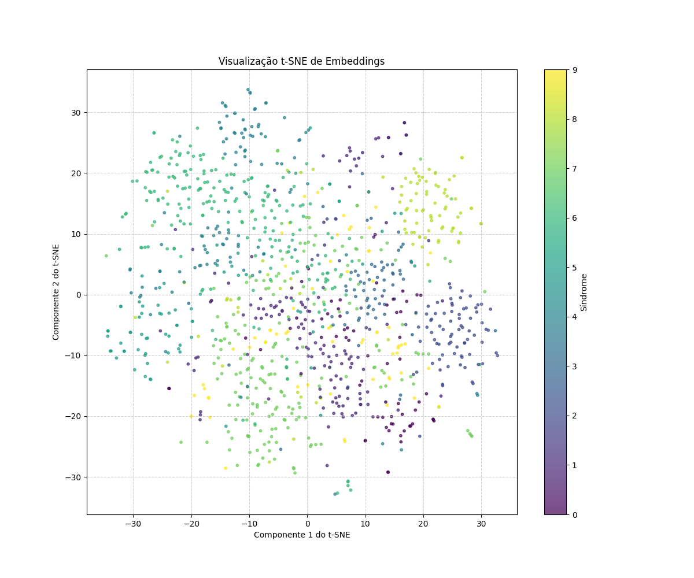
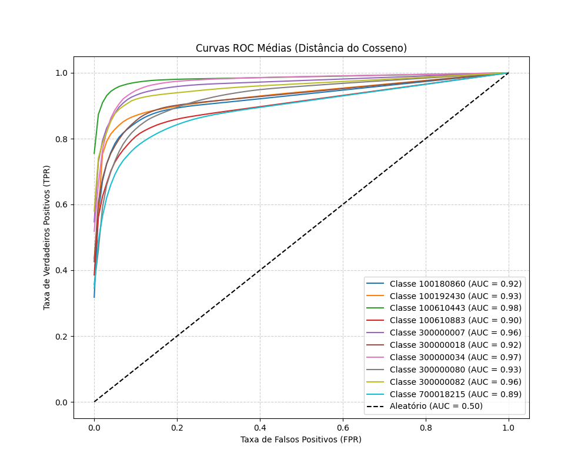
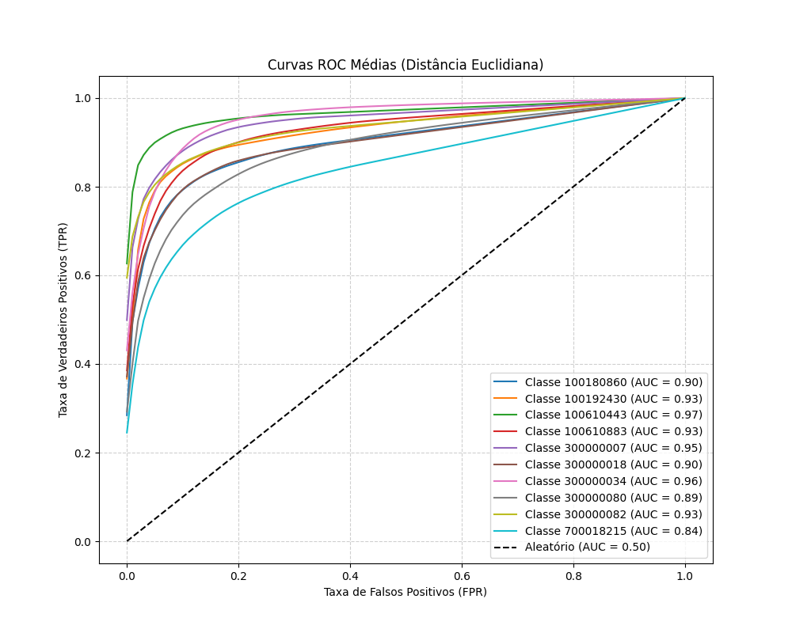

# Classificação de Síndromes com KNN e Embeddings

Este repositório contém um projeto onde eu exploro a classificação de síndromes a partir de embeddings de imagens.  
A ideia foi pegar os vetores de características já extraídos, organizar os dados e aplicar um pipeline simples, mas completo, para entender a qualidade desses embeddings.

---

# 🧠 Relatório de Análise de Embeddings e Classificação utilizando KNN

## 1. Metodologia

### 🎯 Objetivo
Explorar a capacidade de **embeddings pré-treinados** para distinguir entre diferentes **síndromes**, utilizando um pipeline de classificação baseado no **algoritmo K-Nearest Neighbors (KNN)**.

O objetivo principal foi avaliar o desempenho de diferentes **métricas de distância** (*Euclidiana* e *Cosseno*) e identificar a **configuração ótima do KNN**.

---

### 🧹 Pré-processamento dos Dados
Os dados foram carregados a partir do arquivo `mini_gm_public_v0.1.p`, que consiste em um dicionário aninhado com:
- identificadores de síndrome, sujeito e imagem,  
- e seus respectivos **vetores de embedding**.

O primeiro passo foi “aplanar” essa estrutura em um **DataFrame do Pandas**, onde cada linha representa uma imagem com sua síndrome associada e o vetor correspondente.

**Etapas e observações:**
- Realizada **Análise Exploratória dos Dados (EDA)**.  
- Nenhum **valor ausente** encontrado.  
- **Distribuição equilibrada** das imagens por síndrome.  
- **Dimensão dos embeddings:** 320.  

---

### 🌈 Visualização de Embeddings com t-SNE



Utilizei **t-Distributed Stochastic Neighbor Embedding (t-SNE)** para projetar os embeddings em 2D.

> 🎨 Resultado: surgiram alguns clusters bem definidos, mas com **sobreposição significativa**.  
> Isso indica que os embeddings capturam informação discriminativa, **mas não de forma perfeitamente separável**.

---

### ⚙️ Escolha do Algoritmo e Parâmetros
Optei pelo **KNN** pela sua **simplicidade**, **interpretabilidade** e adequação a problemas baseados em distância.

Implementei uma **versão customizada** do algoritmo que:
- permite alternar entre **distâncias Euclidiana e Cosseno**,  
- e calcula **probabilidades de classe** pela proporção de vizinhos.

#### 🔢 Hiperparâmetro *k*
- Utilizada **validação cruzada estratificada com 10 folds**.  
- Testados valores de *k* entre **1 e 15**.  
- **Métrica principal:** *F1-score macro*, por equilibrar *precisão* e *recall*.

---

### 📈 Métricas de Avaliação
As métricas utilizadas foram:

- **AUC-ROC** → mede a capacidade do modelo de distinguir classes.  
- **F1-score (macro average)** → usada na escolha de *k* e comparação entre distâncias.  
- **Top-5 Accuracy** → proporção de vezes em que a classe verdadeira está entre as 5 mais prováveis.  
  > 💡 Útil em cenários de recomendação ou diagnóstico assistido.

---

## 2. Resultados

### 🔍 Visualização t-SNE
A visualização mostrou **separação parcial entre síndromes**:  
clusters distintos, porém com **sobreposição**.  
> ✅ Os embeddings carregam informação útil, mas não perfeitamente separável.

---

### 📊 Curvas ROC – Distância do Cosseno



Com a **distância do Cosseno**, o desempenho foi **sólido**:
- **AUCs entre 0.89 e 0.98**,  
- maioria acima de **0.90**.

> Isso indica que os embeddings, combinados com a similaridade de Cosseno, **distinguem bem as síndromes**.

---

### 📈 Curvas ROC – Distância Euclidiana



A **distância Euclidiana** também teve bons resultados:
- **AUCs entre 0.84 e 0.97**,  
- ligeiramente inferiores em algumas classes (ex: `700018215`: 0.84 vs 0.89 no Cosseno).

---

### 🧾 Resumo de Desempenho por Distância

| Tipo de Distância | K Ótimo | AUC Médio | F1 Médio | Top-5 Accuracy |
|--------------------|---------|------------|-----------|----------------|
| **Euclidiana** | 15 | 0.9178 | 0.6835 | 0.9366 |
| **Cosseno** | 7 | 0.9364 | 0.7454 | 0.9499 |

> 🔹 O Cosseno superou a Euclidiana em **todas as métricas**.

---

## 3. Análise

- **F1 médio:** 0.7454 (Cosseno) vs 0.6835 (Euclidiana)  
- **AUC médio:** 0.9364 vs 0.9178  
- **Top-5 Accuracy:** 0.9499 vs 0.9366  

📌 **Conclusão:**  
O **Cosseno** é mais adequado para embeddings, pois mede **ângulo entre vetores**, relevante em espaços normalizados.

Além disso:
- O **k ótimo menor** (7 contra 15) indica **vizinhanças mais coesas**.  
- **Top-5 Accuracy acima de 93%** mostra alta capacidade de incluir a classe correta nas 5 primeiras opções.

---

## 4. Desafios e Soluções

### ⚠️ Principais desafios
- Garantir **robustez na avaliação** → resolvido com **validação cruzada estratificada**.  
- Definir **valor ideal de k** → resolvido com **busca entre 1 e 15** e seleção baseada em F1 macro.  
- Necessidade de **versão customizada do KNN** → permitiu cálculos flexíveis e análise detalhada (curvas ROC e Top-K Accuracy).

---

## 5. Recomendações

1. 🔍 **Explorar outros classificadores:**  
   SVM, Random Forest, MLP — podem oferecer **melhor desempenho ou generalização**.

2. ⚙️ **Otimizar hiperparâmetros:**  
   Usar **grid search** ou **random search** mais amplo, aliado à validação cruzada.

3. 🧾 **Análise de erros por classe:**  
   Criar **matriz de confusão média** para identificar síndromes mais confundidas.

4. ⚖️ **Avaliar cenários com desequilíbrio:**  
   Testar técnicas como **SMOTE** ou **pesos de classe**.

5. 🧠 **Interpretabilidade dos embeddings:**  
   Aplicar **SHAP** ou **LIME** para entender o que diferencia as síndromes.

6. 📈 **Aumento de dados:**  
   Expandir o dataset para **melhorar a robustez** dos resultados.

---

## 🏁 Conclusão

O estudo confirmou a **eficácia dos embeddings combinados com KNN** na classificação de síndromes.

> 🚀 A **distância do Cosseno** apresentou o **melhor desempenho geral**, oferecendo uma **base sólida para futuras análises e aprimoramentos**.

---

## O que eu implementei

- **Carregamento dos dados**: uso arquivos `.p` no formato pickle e transformo em um DataFrame bem estruturado com pandas.
- **Análise exploratória**: verifico a quantidade de síndromes, a distribuição das imagens por classe e aponto se existe desbalanceamento.
- **Visualização**: aplico **t-SNE** para reduzir os embeddings e gerar uma visualização em 2D dos clusters de síndromes.
- **Classificação com KNN**:
  - Testo diferentes valores de `k` e duas métricas de distância: **euclidiana** e **cosseno**.
  - Uso validação cruzada estratificada para garantir uma avaliação justa entre as classes.
- **Métricas de avaliação**:
  - AUC (área sob a curva ROC)
  - F1-Score (macro)
  - Top-k Accuracy (top-5 no meu caso)
- **Resultados**:
  - Gráficos de curvas ROC médias por classe
  - Tabelas com médias de AUC, F1 e Top-5 Accuracy
  - Melhor valor de `k` para cada métrica de distância

---

## Estrutura do pipeline

1. **Carrego e organizo os dados**  
2. **Faço EDA (análise exploratória)**  
3. **Visualizo embeddings com t-SNE**  
4. **Treino e avalio modelos KNN (com distância euclidiana e cosseno)**  
5. **Gero métricas, tabelas e gráficos**  

---

## Como rodar o projeto

Siga os passos abaixo para configurar o ambiente e executar a aplicação:

1. **Crie um ambiente virtual em Python**  
   O ambiente virtual garante que as dependências do projeto fiquem isoladas.  
   ```bash
   python -m venv .venv
   ```

2. **Ative o ambiente virtual**
  - **Linux/MacOS:**
  ```bash
  source .venv/bin/activate
  ```

  - **Windows PowerShell:**
  ```bash
  .venv\Scripts\Activate
  ```

3. **Instale as dependências do projeto**
  ```bash
  pip install -r requirements.txt
  ```

4. **Execute o projeto**
  ```bash
  python main.py
  ```

